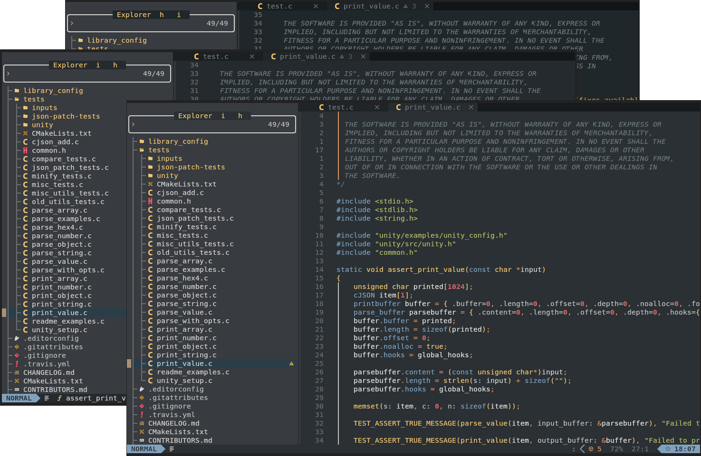

# Hybrid Neovim Colorscheme

A Neovim colorscheme ported from `w0ng/vim-hybrid` vim theme and `sjarvie/vim-hybrid-vscode-theme/` theme. The scheme combines:

-   Default palette from [Tomorrow-Night](https://github.com/chriskempson/vim-tomorrow-theme).
-   Reduced contrast palette from [Codecademy](https://www.codecademy.com)'s
    online editor.
-   Syntax group highlighting scheme from [Jellybeans](https://github.com/nanotech/jellybeans.vim)
- Vimscript from [Solarized](https://github.com/altercation/vim-colors-solarized)

Repository based on `datsfilipe/nvim-colorscheme-template` template.



## Usage

### Using with lazy.nvim (from GitHub)

After publishing to GitHub, change the `dir` to use the repository:

```lua
return {
  {
    "chodak166/nvim-hybrid-theme",
    name = "hybrid-theme",
    lazy = false,
    priority = 1000,
    config = function()
      require("hybrid-theme").setup({
        background_variant = "base",
      })
      require("hybrid-theme").colorscheme()
    end,
  },
}
```

### Using with lazy.nvim (local development)

```lua
return {
  {
    dir = "/path/to/nvim-hybrid-theme",
    name = "hybrid-theme",
    lazy = false,
    priority = 1000,
    config = function()
      require("hybrid-theme").setup({
        theme = "dark",
        transparent = false,
        background_variant = "base",
        italics = {
          comments = true,
          keywords = false,
          functions = false,
          strings = false,
          variables = false,
        },
      })
      require("hybrid-theme").colorscheme()
    end,
  },
}
```

### Configuration Options

- `theme` (default: `"dark"`): Set to `"dark"` or `"light"`
- `transparent` (default: `false`): Enable transparent background
- `background_variant` (default: `"base"`): Background color variant for dark mode
  - `"base"`: `#20272A
  - `"semi_flat"`: `#242A2E` (slightly lighter)
  - `"flat"`: `#2A3034` (light)
- `italics`: Enable italics for different syntax elements
  - `comments` (default: `true`)
  - `keywords` (default: `false`)
  - `functions` (default: `false`)
  - `strings` (default: `false`)
  - `variables` (default: `false`)
- `overrides`: Custom highlight overrides

## Contributing

Contributions are welcome, please open an issue if you encounter any bug or if you find any improvements are needed for the code, also feel free to open a PR.

Take a look at the [Development Guide](./DEVELOPMENT_GUIDE.md)

## License

[MIT License](LICENSE)
